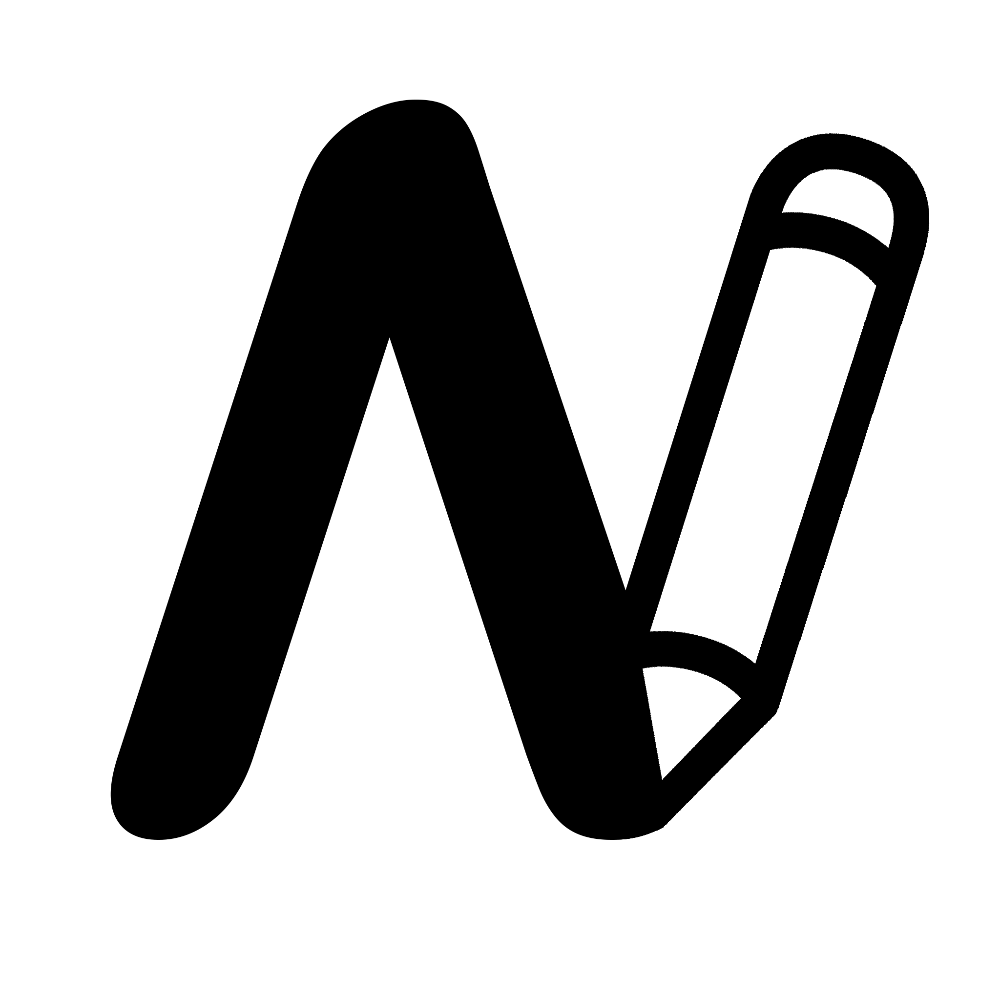

<!-- PROJECT LOGO -->

 

  

<h3  align="center">Noteworthy</h3>

  

A browser based extension that allows you to take notes and annotate any page!

 

<a  href="https://chrome.google.com/webstore/search/Noteworthy"><strong>Go To Extension »</strong></a>

 

 

<a  href="https://github.com/Noteworthy-Extension/Noteworthy-Extension">View Demo</a>

·

<a  href="https://github.com/Noteworthy-Extension/Noteworthy-Extension/issues">Report Bug</a>

·

<a  href="https://github.com/Noteworthy-Extension/Noteworthy-Extension/issues">Request Feature</a>

  
  
  

<!-- TABLE OF CONTENTS -->

Table of Contents

<ol>

<li><a  href="#about-the-project">About The Project</a></li>

<li><a  href="#built-with">Built With</a></li>

<li><a  href="#contributing">Contributing</a></li>

<li><a  href="#license">License</a></li>

<li><a  href="#contact">Contact</a></li>

</ol>

## About The Project

Noteworthy is a browser based extension that allows you to make annotations and take notes on any website. It has many features from text to drawing that all work on any website. With local storage, the notes you take are saved locally to your device so that the notes load when you visit the site again. 

Why to use Noteworthy:

* Taking notes on the website itself is faster and easier meaning you will likely take more and better notes!

* Our note storage system is local to your device meaning that it never goes through an external database where the data could be collected.

* Putting notes on a page that you will visit again will lead to you actually looking back at your notes versus never opening that document that you might be taking notes on now!  

(<a  href="#readme-top">back to top</a>)

  

### Built With

Our app is built with pure Typescript, SASS, and then compiled to pure JavaScript.

(<a  href="#readme-top">back to top</a>)

## Getting Started

To use our app, simple install the extension from the <a href="https://chrome.google.com/webstore/category/extensions">Chrome Web Store</a>.

### 
<a href="https://chrome.google.com/webstore/search/Noteworthy">Install here</a>

(<a  href="#readme-top">back to top</a>)

## Usage

Use this space to show useful examples of how a project can be used. Additional screenshots, code examples and demos work well in this space. You may also link to more resources.

  

_For more examples, please refer to the [Documentation](https://example.com)_

  

(<a  href="#readme-top">back to top</a>)

## Roadmap

  

- [x] Add Changelog

- [x] Add back to top links

- [ ] Add Additional Templates w/ Examples

- [ ] Add "components" document to easily copy & paste sections of the readme

- [ ] Multi-language Support

- [ ] Chinese

- [ ] Spanish

  

See the [open issues](https://github.com/othneildrew/Best-README-Template/issues) for a full list of proposed features (and known issues).

  

(<a  href="#readme-top">back to top</a>)

## Contributing

Contributions are what make the open source community such an amazing place to learn, inspire, and create. Any contributions you make are **greatly appreciated**.

If you have any suggestions for features or find any bugs, please let us now!

As a developing app, please give us a good review on the <a href="https://chrome.google.com/webstore/search/Noteworthy">Chrome Web Store</a>.

 #### <a  href="https://github.com/Noteworthy-Extension/Noteworthy-Extension/issues">Report a Bug / Request a Feature</a>

(<a  href="#readme-top">back to top</a>)

## License

Distributed under the MIT License. See `LICENSE.txt` for more information.

(<a  href="#readme-top">back to top</a>)

## Contact

If you have an questions or anything to say, contact us here:

### noteworthy.extension@gmail.com

(<a  href="#readme-top">back to top</a>)

## Acknowledgments

  ### Developers
  * @AwesomeMarley
  * @Touch-Grass

(<a  href="#readme-top">back to top</a>)
